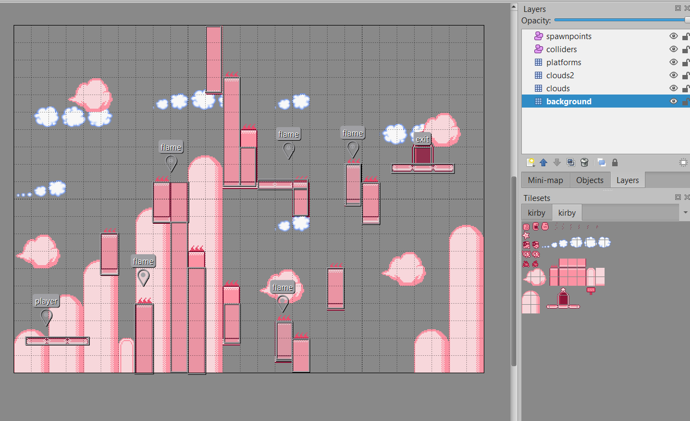
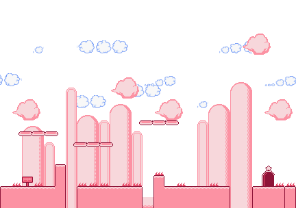
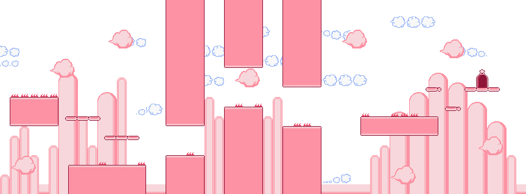
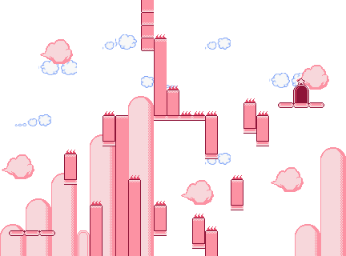
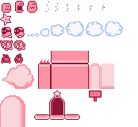

# Kirby_Web_Game
Game showcase:  

 
A kirby style web game made using Kaboom.js and Tiled. 

npm run dev to play - Controls: WASD/Arrow keys to move and Ctrl/Z for kirby suction.

Tiled was used to create the layout for the levels, and used to set the spawnpoints and colliders for the game. 
 

Level 1:  

Level 2:  

Level 3:  

Asset tileset used:  
